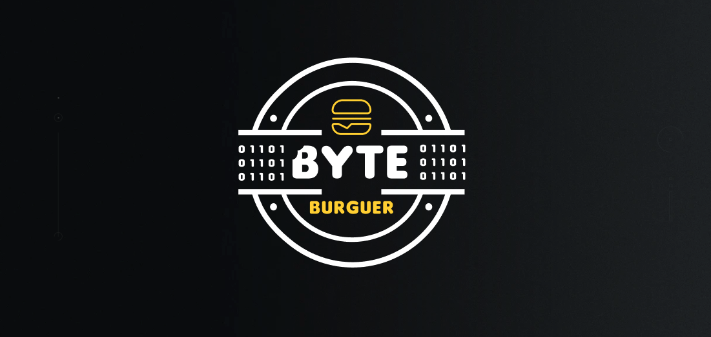

<!-- Permite  a funcionalidade de voltar ao topo -->

<!-- Titulo do projeto -->

    

___________________________________________________

<!-- Informações visuais do projeto -->

    
    
    
    
    

<!-- Breve descrição sobre o projeto -->

  Sistema com o objetivo de gerenciar os pedidos de uma lanchonete. Construído por <a href="https://github.com/CarlosEduAC">Carlos Cardoso</a>, <a href="https://github.com/LuanPCunha">Luan Cunha</a>, <a href="https://github.com/matheusantonio">Matheus Cardoso</a> e <a href="https://github.com/vinisaeta">Vinicius Saeta</a>.
  

<!-- Tabela de conteúdo do projeto -->

# 📕 License

Lançado em 2023 📕 License

Construído por [Carlos Cardoso](https://github.com/CarlosEduAC), [Luan Cunha](https://github.com/LuanPCunha), [Matheus Cardoso](https://github.com/matheusantonio) e [Vinicius Saeta](https://github.com/vinisaeta) 🚀.
Esse projeto esta sobre [MIT license](./LICENSE).

(<a href="#readme-top">Volta ao topo</a>)

[swaggerlogo]: .github/images/swagger.svg
[menufunc]: .github/images/func_menu.png
[customerfunc]: .github/images/func_customer.png
[shoppingcartfunc]: .github/images/func_shopping_cart.png
[checkoutfunc]: .github/images/func_checkout.png
[orderfunc]: .github/images/func_order.png
[diagramaimplantacaok8s]: .github/images/diagrama-de-implantacao-k8s.png
[visaoinfra1]: .github/images/visao-de-infraestrutura-parte-1.png
[visaoinfra2]: .github/images/visao-de-infraestrutura-parte-2.png
[visaomacro]: .github/images/visao-macro.png
